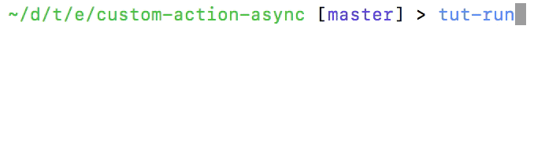

<hr>

<a href="https://travis-ci.org/Originate/tutorial-runner">
  
</a>
<a href="https://ci.appveyor.com/project/kevgo/tutorial-runner/branch/master">
  
</a>
<a href="https://david-dm.org/originate/tutorial-runner">
  
</a>
<a href="https://david-dm.org/originate/tutorial-runner#info=devDependencies">
  
</a>
<a href="https://yarnpkg.com">
  
</a>

Tutorial Runner executes documentation written in Markdown,
similar to how a human reader would execute it if they were reading and following it.
It also ensures that links and images in your documentation point to existing targets.

There are no requirements how the executable documentation must look like:
You can execute embedded source code in any programming language
(that is available on your computer),
tables, bullet point lists,
as well as plain text in any human language.
An example is the document you are reading right now,
which is verified for correctness by Tutorial Runner.


## Why you need it

* __evergreen tutorials:__
  Your documentation is always correct,
  whether you change it or the product.
* __[semantic versioning](http://semver.org):__
  Know whether a change affects documented behavior.
* __[readme-driven development](http://tom.preston-werner.com/2010/08/23/readme-driven-development.html):__
  Let executable documentation of your product drive its implementation.


## How it works

To make a part of a Markdown file actionable by Tutorial Runner,
wrap it in `<a>` tags with class `tutorialRunner_*`.
As an example,
let's say a tutorial tells the reader to create a file `config.yml`
with the content `foo: bar`.
The markdown code of this tutorial might look something like this:

```
## Creating a configuration file

Please create a file with the name __config.yml__ and the content:
`​``
foo: bar
`​``
```

To make this part of the documentation executable,
surround it with an `<a>` tag that specifies that we want to create a file:

<a class="tutorialRunner_runMarkdownInTutrun">

```
## Creating a configuration file

<a class="tutorialRunner_createFile">
Please create a file with the name __config.yml__ and the content:
`​``
foo: bar
`​``
</a>
```

</a>

The class `createFile` tells TutorialRunner that this block is supposed to create a file.
It takes the filename and content to create from the text inside this block
(not metadata, but the same text the user sees),
and creates the file in the current working directory.
Text outside of `<a>` tags is ignored.

You execute TutorialRunner by by calling `tut-run` on the command line.


## Built-in Actions

Tutorial Runner provides a number of built-in actions
for activities typically performed in software programming tutorials.

#### Filesystem

* [change the current working directory](documentation/actions/cd.md)
* [create a file](documentation/actions/create_file.md)
* [create a directory](documentation/actions/create_directory.md)
* [verifyFileContent](documentation/actions/verify_file_content.md)
* [verify that a linked directory exists](documentation/actions/verify_linked_directory_exists.md)
* [display the content of a source code file](documentation/actions/verify_matches_source_code_file.md)


#### Console commands
* [run a console command](documentation/actions/run_console_command.md)
* [start and stop long-running console commands](documentation/actions/start_stop_console_command.md)


#### Source code

* [run Javascript code](documentation/actions/run_javascript.md)


#### Tools and frameworks

* [required NodeJS version](documentation/actions/minimum-node-version.md)
* [verify NPM installation instructions](documentation/actions/verify_npm_install.md)


## Custom actions

Let's create a custom block.
All it does is print "hello world" when running.
It will be triggered via this piece of Markdown:

<a class="tutorialRunner_createMarkdownFile">
```markdown
<a class="tutorialRunner_helloWorld">
</a>
```
</a>

The definition for this block lives in the file:

<a class="tutorialRunner_createFile">
__tut-run/hello-world-action.js__

```javascript
module.exports = function(env) {
  formatter = env.formatter

  formatter.start('greeting the world')
  formatter.output('Hello world!')
  formatter.success()
}
```
</a>

Notice that the file name must use [kebab-case](http://wiki.c2.com/?KebabCase).
<a class="tutorialRunner_runMarkdownFile">
The formatter displays test progress on the console as the test runs.
</a>



Definitions of custom blocks live in the directory `tut-run`.
Each block lives in its own file, whose name is the block name in kebab-case.
The file must export a function that executes the block.
It is given a hash of named arguments.

One of the named arguments is `formatter`,
it provides an object that allows to print test output to the console.
Call `formatter.start(<activity name>)` before you run an activity.
This prints the given activity as _currently running_ (using a yellow pointer)
and prepares the formatter to dump console output below it.
`formatter.output(text)` allows to print output of the currently running action
on the console. This output is removed when the action succeeds.
When the test succeeds, call `formatter.success()`
to print this activity using a green checkmark
and remove all of its console output.
If it fails, call `formatter.error()` with the error message.
Please don't use `console.log` to avoid interfering with the formatter's UI management.
If you cannot avoid this, use a simpler and more robust formatter via the `--format=simple` parameter to `tut-run`.

The handler method can accept a callback in the second parameter
in order to perform asynchronous operations.
See [here](examples/custom-action-sync) for a synchronous working example,
and [here](examples/custom-action-async) for the asynchronous version.
You can write the handler in any language that transpiles to JavaScript,
for example [CoffeeScript](http://coffeescript.org),
[LiveScript](http://livescript.net),
or [BabelJS](https://babeljs.io).
Just make sure that your project contains a local installation of your transpiler,
since Tutorial Runner does not find globally installed transpilers.
This means your project should have a `package.json` file listing the transpiler
you want to use (in addition to any other NPM modules you want to use).


### Using the searcher helper

More realistic tests for your Markdown tutorial
will need to access document content
in order to use it in tests.
The DOM nodes of the active block
- including their type, content, and line number -
are provided to your handler function
via the the `nodes` field of the first argument.
You can access this data directly
or use a helper that is provided to you via the `searcher` field of the first parameter.
To demonstrate how this works,
here is a simple implementation of an action that runs a code block in the terminal.

<a class="tutorialRunner_createMarkdownFile">
```
<a class="tutorialRunner_consoleCommand">
`​``
echo "Hello world"
`​``
</a>
```
</a>

Here is the block definition implemented using the `searcher` helper.

<a class="tutorialRunner_createFile">
__tut-run/console-command.js__
```javascript
child_process = require('child_process')

module.exports = function(env) {
  const formatter = env.formatter
  const getNode = env.searcher.nodeContent
  // you can also work with env.nodes directly here if you want

  formatter.start('running console command')

  const commandToRun = getNode({type: 'fence'}, function(match) {
    if (match.nodes.length === 0) return 'this active tag must contain a code block with the command to run'
    if (match.nodes.length > 1) return 'please provide only one code block'
    if (!match.content) return 'you provided a code block but it has no content'
  })

  formatter.refine('running console command: ' + commandToRun)
  formatter.output(child_process.execSync(commandToRun, {encoding: 'utf8'}))
  formatter.success()
}
```
</a>

<a class="tutorialRunner_runMarkdownFile">
</a>

- The `searcher.nodeContent` method returns the content of the DOM node
that satisfies the given query.
In this case we are looking for a fenced code block,
hence the query is `{type: 'fence'}`.
Providing an array for the type (e.g. `{type: ['code', 'fence']}`)
retrieves all nodes that have any of the given types.
The second parameter is an optional validation method.
Its purpose is to make it easy and readable to provide specific error messages
that make your custom block definition user-friendly and easy to debug.
Its parameter is an object containing the content of the determined node
as well as an array of all the nodes that match the given query.
Strings returned by this method get printed as errors to the user and cause the test to fail,
falsy return values indicate that the validation has passed,
- The `formatter.refine` method allows to tell the formatter
more details about the currently running activity as they become known.
This helps produce better terminal output.


## Formatters

Tutorial Runner supports a variety of formatters:

* __iconic formatter:__
  the most modern formatter.
  Indicates test status using pretty icons.
  Shows test output only when steps run,
  and cleans it out when done to show a clean summary of the test.
  This is the default formatter.

* __colored formatter:__
  Indicades test status using colored test names.
  Shows test output only when steps run,
  and cleans it out when done to show a clean summary of the test.

* __robust formatter:__
  The most robust formatter, similar to the one [Cucumber](http://cucumber.io) uses.
  Shows test output before the steps.
  Use this formatter if the other ones don't work for you.

The `robust` formatter is best for development,
the `colored` or `iconic` formatters
produce more concise output when running as part of a larger test suite.


## Installation

- runs on macOS, Linux, Windows
- install [Node.JS](https://nodejs.org) version 4, 5, or 6
- run `npm i -g tutorial-runner`
- in the root directory of your code base, run `tut-run`


## Configuration

You can configure Tutorial Runner via a configuration file.
To create one, run:

<a class="tutorialRunner_runConsoleCommand">
```
$ tut-run setup
```
</a>

The created configuration looks like this:

<a class="tutorialRunner_verifyFileContent">
__tut-run.yml__

```yml
files: '**/*.md'
format: robust
useTempDirectory: false

actions:

  runConsoleCommand:
    globals: []
```
</a>

- the `files` key describes via a glob function which files are executed by Tutorial Runner.
  It automatically ignores hidden folders as well as `node_modules`.

- the `actions` section contains configuration information specific to actions.
  Please see the documentation for the respective action for more details.


## Related Work

There are many other good testing tools out there.
They can either be combined with Tutorial Runner
or could be viable alternatives to it, depending on your use case:

* [Cucumber](https://cucumber.io):
  Runs tests via a specialized DSL that is optimized for describing features
  via user stories, acceptance criteria, and example scenarias.
  Tutorial Runner and Cucumber complement each other,
  i.e. you would use Tutorial Runner for the end-user facing documentation on your web site
  and Cucumber for agile, collaborative, behavior-driven day-to-day development,
  driven by Tutorial Runner.

* [Gauge](http://getgauge.io):
  a "Cucumber for Markdown".
  With Tutorial Runner there are no restrictions on how the Markdown has to look like;
  it can be 100% human-friendly prose.

* [doctest](https://docs.python.org/3/library/doctest.html):
  executes only actual code blocks in your documentation,
  and verifies only that it runs without errors.
  Tutorial Runner can run anything that can be described textually,
  and verify it in arbitrary ways.

* [mockdown](https://github.com/pjeby/mockdown):
  like doctest, with verification of the output.
